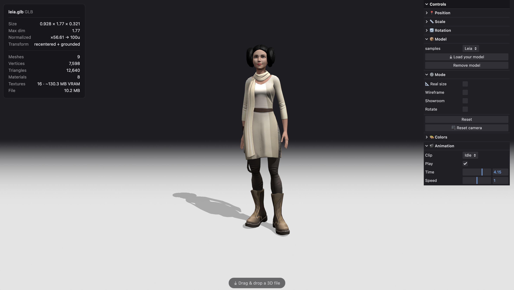

# 3D-Models-Load

   

A browser viewer to inspect 3D assets before production: drag & drop your model, check its stats, tweak material colors, play animations, and show it off in Studio mode.

## Usage

Try the [live demo](https://3d-models-load.netlify.app/), or run it locally:

```shell
git clone https://github.com/sboez/3D-Models-Load.git
cd 3D-Models-Load
npm install
npm run dev
```

## Features

- **Drag & drop** any supported model straight into the scene
- **Stats panel** — dimensions, triangle & vertex count, materials, textures, file size
- **Material colors** — recolor each material to check how the asset is split
- **Wireframe** mode
- **Animations** — play/pause, scrub the timeline, switch clips, adjust speed
- **Studio** mode — a polished showcase with soft, even (shadowless) lighting, a reflective floor, and a gradient backdrop you can recolor via the color picker or Random Color, plus a background-intensity slider (rendered with WebGPU / TSL)
- **Real size** mode — view the model at its true file dimensions on a Blender-style adaptive metric grid
- Every model is automatically centered, grounded and normalized to a consistent size

## Supported formats

**.GLTF .GLB .FBX .OBJ .STL .DAE .PLY .3MF**

Multi-file assets work too: drop the model together with its external files (`.bin`, `.mtl`, textures) — just select them all at once.

## Animations

Drop your model and its animation files at the same time. The animation files must share the same skeleton (bone names) as the model. A clip named **Idle** is played first by default when present.

## Roadmap (V2)

- [x] .PLY and .3MF formats
- [x] Drag & drop
- [x] Stats panel
- [x] Wireframe
- [x] Animations
- [ ] Screenshot
- [ ] Export (GLB)

[](https://3d-models-load.netlify.app/)
